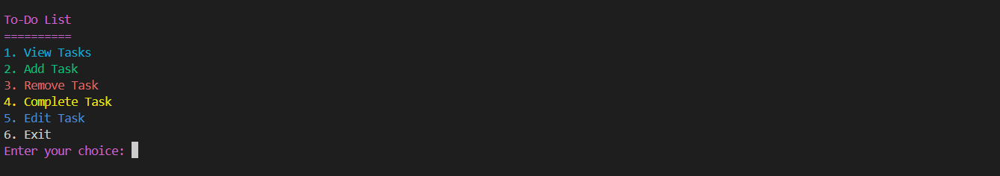

# 📝 CLI To-Do List

CLI To-Do List is a simple and interactive command-line application that helps you manage your tasks efficiently. It features task prioritization, persistent storage, sorting by priority, and a clean, colorful interface for an enhanced user experience.

## 📸 Screenshot
Here’s how the CLI looks in action:



## 📌 Table of Contents
- [🚀 Installation](#-installation)
- [🎮 Usage](#-usage)
- [📂 File Storage](#-file-storage)
- [📌 Task Sorting](#-task-sorting)
- [✨ Features](#-features)
- [🔧 Technologies Used](#-technologies-used)
- [📌 Dependencies](#-dependencies)
- [📜 License](#-license)

---

## 🚀 Installation

To set up the project locally, follow these steps:

```sh
# Clone the repository
git clone https://github.com/alhussienhazem/CLI-To-Do-List.git

# Navigate to the project folder
cd CLI-To-Do-List

# Install dependencies
pip install colorama

# Run the program
python todo.py
```
---

## 🎮 Usage

Once the program is running, choose an option from the menu:

| Action           | Key Press  |
|-----------------|------------|
| 📋 **View Tasks** | `1` |
| ➕ **Add Task** | `2` |
| ❌ **Remove Task** | `3` |
| ✅ **Complete Task** | `4` |
| 🚪 **Exit** | `5` |

---

## 📂 File Storage  

- 📌 Tasks are saved in a `tasks.txt` file.  
- 🔄 The program automatically loads tasks when restarted.  
- 🔢 Tasks are stored in the format: `Priority - Task Description`.  

---

## 📌 Task Sorting

Tasks are automatically sorted based on priority:

1️⃣ **High Priority** tasks appear first.  
2️⃣ **Medium Priority** tasks are listed next.  
3️⃣ **Low Priority** tasks appear last.  

The sorting algorithm ensures that tasks remain structured, making it easier to focus on high-priority items first.

---

## ✨ Features

✔️ **Task Prioritization** – Assign High, Medium, or Low priority to tasks.  
✔️ **Task Sorting** – Automatically arranges tasks based on priority.  
✔️ **Interactive Command-Line UI** – Colorful and well-structured interface.  
✔️ **Persistent Storage** – Saves tasks automatically to a file (`tasks.txt`).  
✔️ **Edit Tasks** – Modify existing tasks easily.  
✔️ **User-Friendly Navigation** – Intuitive menu options for easy task management.

---

## 🔧 Technologies Used

🟢 **Python** – Core programming language.  
🎨 **Colorama** – Adds color to the CLI interface.  
💾 **File Handling** – Ensures task persistence.
📊 **Sorting Algorithm** – Arranges tasks by priority.

---

## 📌 Dependencies
- **Python 3.12.3**
- **colorama** (for colored text output)

---

## 📜 License

This project is licensed under the **MIT License**. See the LICENSE file for more details.
